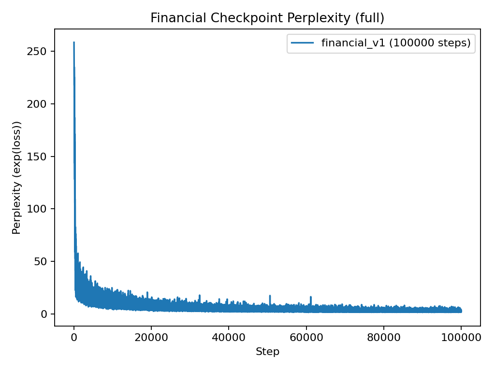
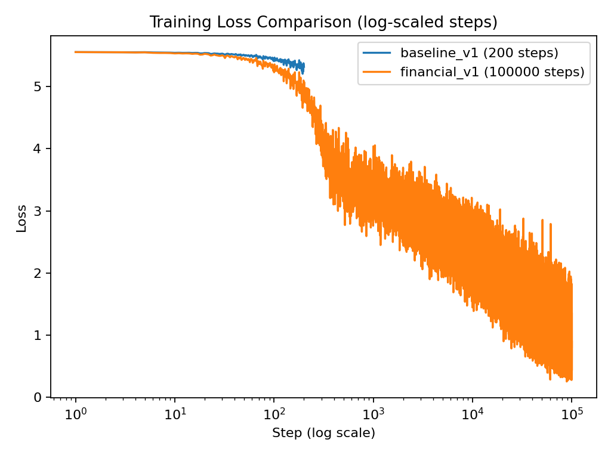
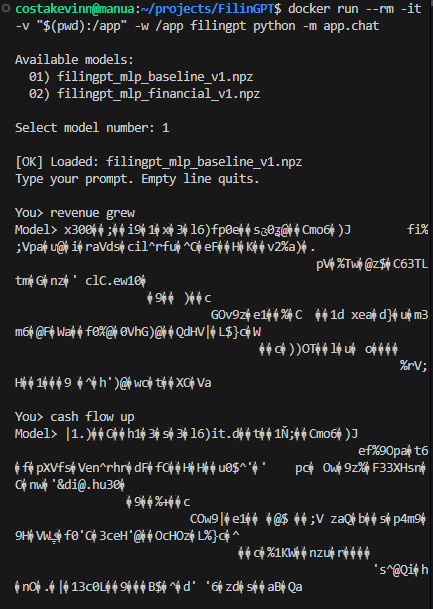

# FilinGPT - A Byte-Level Financial Language Model

Byte-level financial language model built from scratch using NumPy.

FilinGPT is an end-to-end autoregressive language modeling system trained on SEC 10-K filings. The project demonstrates custom neural network implementation, financial NLP preprocessing, and quantitative evaluation without relying on deep learning frameworks.

---

## 🚀 Highlights

- Custom MLP-based autoregressive model (NumPy only)
- Byte-level tokenization (vocab size = 258)
- Context window: 16 tokens
- Cross-entropy optimization with perplexity tracking
- Full ETL pipeline (10-K → MDA → chunks → batches)
- Dockerized execution
- Automated training comparison reports
- RAG-ready financial document structure

---

## 📊 Results

| Metric | Baseline (200 steps) | Financial (100k steps) |
|--------|----------------------|------------------------|
| Final Loss | 5.3182 | 0.8071 |
| Final Perplexity | 204.02 | **2.24** |
| Perplexity Reduction | 21% | **99.13%** |

The model reduced perplexity from 258 → 2.24, demonstrating strong convergence and structured financial language acquisition.

---

## 📈 Training Dynamics

### Perplexity (100k steps)



### Loss Comparison (log scale)



---

## 💬 Generation Quality

<table>
<tr>
<td align="center"><b>Baseline (200 steps)</b></td>
<td align="center"><b>Financial (100k steps)</b></td>
</tr>
<tr>
<td></td>
<td></td>
</tr>
</table>

The baseline model produces mostly incoherent byte-level noise, while the financial checkpoint generates structured financial English with recognizable domain terminology.

---

## 🏗 System Architecture

```

data/      → Financial document pipeline (bronze/silver/gold)
etl/       → 10-K & MDA extraction
prep/      → Chunking, tokenization, batching
core/      → Model, training loop, inference
scripts/   → Automated training comparison reports

````

Designed for reproducibility and modular ML experimentation.

---

## 🧠 ML & Engineering Concepts Demonstrated

- Autoregressive language modeling
- Cross-entropy optimization
- Perplexity evaluation
- Byte-level NLP
- Financial domain language modeling
- Data pipeline engineering
- Reproducible ML systems
- Retrieval-ready document preprocessing (RAG extensibility)

---

## 🐳 Run with Docker

```bash
docker build -t filingpt .
docker run --rm -it -v "$(pwd):/app" -w /app filingpt python -m app.chat
````

---

## 📄 License

This project is licensed under the MIT License.
